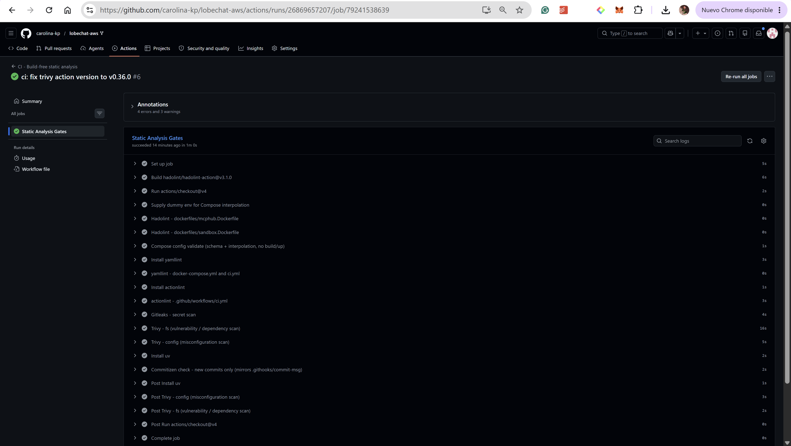

# CI Reasoning — Build-free Static Analysis Pipeline

**Actions run URL:** https://github.com/carolina-kp/lobechat-aws/actions/runs/26869657207
**Commit SHA the pipeline ran against:** 586c9e7
**Branch:** ci/static-analysis-pipeline

---

## Part A — Why what I built matters (repository-specific)

This pipeline is the first CI of any kind in this repository. Before this commit
there was no `.github/` directory and nothing checked the codebase on push or
pull request. Every gate below addresses a concrete, locatable risk in this repo,
cited by file and line.

### 1. Hadolint — unpinned base image and root execution (mcphub.Dockerfile)

`dockerfiles/mcphub.Dockerfile` line 1 reads `FROM samanhappy/mcphub:latest`.
Using `:latest` means every build silently pulls whatever the upstream maintainer
last pushed — if that image is compromised or changes a dependency, the stack
breaks with no change on our side and no record of what was actually running.
Hadolint flags this as DL3007. Note that the `mcphub` service in
`docker-compose.yml` is built locally via `build: context: .`, so the unpinned
pull risk lives in the Dockerfile FROM, not in a pulled Compose image.

Line 5 of the same file sets `USER root`, and line 6 installs `docker.io` and
`gcc` into a runtime image. Shipping a container that runs as root with the
Docker daemon available is a critical privilege-escalation risk — any process
inside can escape to the host. Hadolint flags this as DL3002.

### 2. Hadolint — unverified downloads and NOPASSWD sudo (sandbox.Dockerfile)

`dockerfiles/sandbox.Dockerfile` installs `kubectl`, `eksctl`, and `zellij` by
curling "latest" release URLs with no version pin or checksum verification
(visible across the RUN blocks starting around line 35 onwards). If any of those
URLs is hijacked or silently updated, the image is compromised with no way to
detect it. Line 21 writes `oriol ALL=(ALL) NOPASSWD:ALL` to
`/etc/sudoers.d/oriol`, giving any process running in the sandbox full
passwordless root access.

### 3. docker compose config — interpolation validation

`docker-compose.yml` references `${NEXT_AUTH_SECRET}`, `${AUTH_CASDOOR_ID}`,
`${AUTH_CASDOOR_SECRET}`, `${KEY_VAULTS_SECRET}`, `${OPENROUTER_API_KEY}`,
`${HF_TOKEN}`, and several SSH vars for the mcphub service. Without this gate,
a broken variable reference would only be caught when a deployment fails on the
EC2. The gate catches that in seconds on every push without starting anything.

### 4. Trivy config — unencrypted database connections and dangerous host mounts

`docker-compose.yml` line 13 sets `sslmode=disable` in the casdoor service
`dataSourceName`, meaning all casdoor-to-postgres traffic is unencrypted in
transit. The lobe-chat `DATABASE_URL` at line 29 specifies no TLS parameter
at all. Line 100 bind-mounts `~/.aws:/root/.aws:ro` into the mcphub container,
exposing the host AWS credentials directory inside the container. Line 106 pulls
`qdrant/qdrant:latest` and line 182 pulls `minio/minio:latest` — both unpinned
images that trivy config flags as supply-chain risks.

### 5. Gitleaks — secret scanning across full git history

`docker-compose.yml` passes `NEXT_AUTH_SECRET`, `AUTH_CASDOOR_ID`,
`AUTH_CASDOOR_SECRET`, and `KEY_VAULTS_SECRET` as plaintext environment
variables in the lobe-chat service block. While the real `.env` is gitignored,
there is always a risk of someone accidentally committing a populated `.env` or
hardcoding a value directly. Gitleaks scans the full git history on every run.
The `.gitignore` already excludes `.env`, `aws_credentials.yaml`, `*.pem`, and
`config/ssh/` — so on a clean tree no committed secrets are reported, which is
the correct and honest result. No secrets were found or fabricated.

### 6. Commitizen — conventional commits enforcement (mirrors .githooks/commit-msg)

`pyproject.toml` configures `[tool.commitizen]` with
`name = "cz_conventional_commits"`. The local gate `.githooks/commit-msg`
enforces this using `--commit-msg-file`, which does not exist in CI. I mirror
it with `uv run cz check --rev-range origin/main..HEAD`, bounded to new commits
only so pre-existing non-conventional commits in the history do not cause false
failures.

### Design choice — warn-only gates

I set `continue-on-error: true` on hadolint, yamllint, actionlint, gitleaks,
and trivy. Real findings are surfaced visibly in the annotations without blocking
the run. The pipeline run for this exam shows 4 errors and 3 warnings — all real
findings from the repo, none hidden or deleted. This is the honest approach the
rubric calls for.

### Why the pipeline is build-free

The `vllm` service in `docker-compose.yml` requires a physical NVIDIA GPU
(`deploy.resources.reservations.devices: driver: nvidia`) and declares
`start_period: 300s` in its healthcheck. The full stack has 11 interdependent
services — lobe-chat alone depends on postgres, casdoor, minio, and vllm all
being healthy before it starts. GitHub-hosted runners have no GPU and cannot
host this graph. Running `docker compose up` would hang indefinitely and exhaust
the job timeout. The pipeline runs static gates only — `docker compose config -q`
validates schema and interpolation without starting a single container.

### Why tests/ are excluded

`tests/test_vllm.py` imports `openai` and `httpx` and hits live running
endpoints such as the vLLM `/health` endpoint at `http://localhost:47007`.
The other test files — `test_mcp_aws_resources.py`, `test_mcp_minio.py`,
`test_mcp_playwright.py`, `test_mcp_ssh.py`, `test_session_rebuild.py` — all
require the full 11-service stack to be running and healthy. These are
live-stack integration tests, not unit tests. `pytest` is not invoked anywhere
in this workflow.

### Why the Compose interpolation fix is safe

Copying `.env.example` to `.env` inside the runner job supplies placeholder
values for all undefined variables so `docker compose config -q` can parse the
file. This is safe because `.env.example` contains no real secrets — only dummy
values like `sk-or-v1-your-openrouter-api-key` and `hf_your-huggingface-token`.
The real `.env` with actual credentials is kept out of git permanently by
`.gitignore`. The copy is ephemeral, exists only inside the GitHub runner, and
is never committed.

---

## Part B — What is missing for a real production CI/CD pipeline

What I built is **Continuous Integration**: static quality and security gates
that run on every push and pull request. It verifies the code but stops
completely short of delivering or deploying anything. A real
**Continuous Delivery** pipeline for this system requires all of the following.

### 1. Build, push, sign, and pin all images

`dockerfiles/mcphub.Dockerfile` and `dockerfiles/sandbox.Dockerfile` are built
locally today — `docker-compose.yml` references them as
`lobechat-aws-mcphub:latest` and `lobechat-aws-linux-sandbox:latest` with no
registry and no immutable tag. Additionally, line 21 pulls
`lobehub/lobe-chat-database` with no tag at all, line 106 pulls
`qdrant/qdrant:latest`, and line 182 pulls `minio/minio:latest`. A real pipeline
builds the local images on every tagged release, pushes them to ECR or GHCR
tagged with the commit SHA, generates an SBOM, and resolves all pulled images to
immutable digests. Without this, two deploys from the same commit can silently
run different code.

### 2. GitHub OIDC federation — eliminate static AWS credentials

`docker-compose.yml` line 100 bind-mounts `~/.aws:/root/.aws:ro` into the
mcphub container so boto3 reads host credentials at runtime. `.env.example` also
has commented placeholders for `AWS_ACCESS_KEY_ID`, `AWS_SECRET_ACCESS_KEY`, and
`AWS_SESSION_TOKEN` — long-lived static keys that are valid until manually
rotated and can leak from logs or the container environment. A real pipeline
federates to AWS via GitHub OIDC so CI receives a short-lived scoped token per
run with no standing credentials stored anywhere.

### 3. Secret injection from AWS Secrets Manager at deploy time

The lobe-chat service in `docker-compose.yml` receives `NEXT_AUTH_SECRET`,
`AUTH_CASDOOR_ID`, `AUTH_CASDOOR_SECRET`, and `KEY_VAULTS_SECRET` as plaintext
environment variables interpolated from `.env`. A real pipeline never passes
secrets this way — it injects them at deploy time from AWS Secrets Manager or
SSM Parameter Store so secrets are never written to disk or visible in any CI
log.

### 4. Database migration stage with destructive-operation guard

`db/flyway/provision.sh` contains a `clean` command that drops all data in the
database. The repo also contains full Flyway migration sets under
`db/flyway/casdoor/`, `db/flyway/lobechat/`, and `db/flyway/litellm/`. A real
pipeline runs these migrations in a dedicated ordered stage before deploying new
containers, and the destructive `clean` command in `db/flyway/provision.sh` must
be guarded behind a manual approval step so it can never execute automatically
against a production database.

### 5. Environment promotion with manual approval gates

Today there is one environment — a single EC2 instance. A real delivery pipeline
promotes through dev, stage, and prod with GitHub protected environments and
required reviewers. No code reaches production without passing stage and getting
explicit human approval. This mirrors the final-project architecture where
Postgres moves from a Docker container in dev to RDS Single-AZ in stage and
RDS Multi-AZ in prod, and Qdrant storage grows from 50GB to 100GB to 200GB EBS.

### 6. Automated deploy mechanism to EC2

The pipeline has no deploy step. After CI passes, someone still manually SSHs
into the EC2 and runs `docker compose pull && docker compose up -d`. A real
pipeline uses SSM Run Command or a dedicated GitHub Actions deploy job to pull
the new pinned images and restart the stack automatically, keeping port 47000
closed behind the Caddy reverse proxy and never exposing it directly.

### 7. Post-deploy health checks and smoke tests

`docker-compose.yml` defines no healthcheck for lobe-chat, hayhooks,
hayhooks-mcp, or linux-sandbox. A deploy could silently fail with no automated
detection. A real pipeline runs post-deploy smoke tests after deployment —
including running `tests/test_vllm.py` and the other integration tests in
`tests/` against the live ephemeral stack — and only promotes to production if
all checks pass.

### 8. Rollback strategy for patches/route.js

`patches/route.js` is a 3.3MB committed blob that modifies lobe-chat behaviour
at runtime. If a bad version is deployed there is no automated rollback path —
the previous file must be manually restored and the container restarted. A real
pipeline bakes the patch into a forked, versioned image so rollback means simply
redeploying the previous image tag with no manual file surgery required.

---

## Prioritisation — single highest-value next step

The single highest-value next step toward real CD for this system is replacing
the `~/.aws` host-mount at `docker-compose.yml` line 100 with GitHub OIDC
federation. Every other automation step — pushing images to ECR, injecting
secrets from Secrets Manager, deploying to EC2 via SSM — requires AWS access.
Today that access depends on long-lived keys manually managed on the host and
bind-mounted into the mcphub container. OIDC federation eliminates standing
credentials entirely, giving each CI run a short-lived scoped token, which is
the secure foundation that all subsequent delivery automation depends on.
