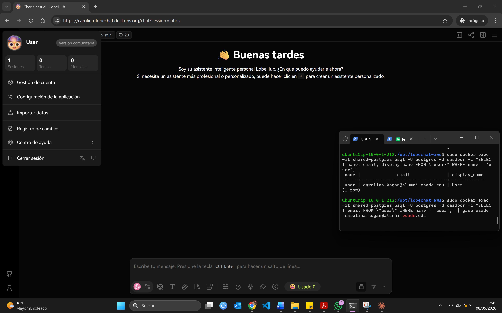
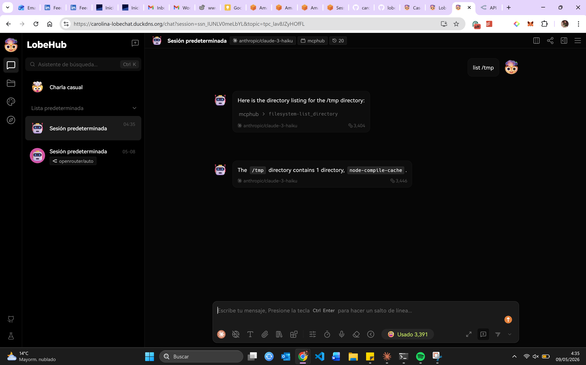

# Final Project — Evidence Report

## 1. Identity

| Field | Value |
|---|---|
| Student name | Carolina Kogan |
| ESADE email | carolina.kogan@alumni.esade.edu |
| GitHub repo URL | https://github.com/carolina-kp/lobechat-aws (private; user `joseporiolrius` invited as collaborator) |
| Latest commit SHA | `5ae9b31169a225d8f7567d2c65d4433e711b60fb` |
| Final tag | `v0.7.0` |

## 2. Public URL

**[https://carolina-lobechat.duckdns.org](https://carolina-lobechat.duckdns.org)**

## 3. Screenshot — LobeChat over HTTPS, logged in



## 4. Screenshot — chat working (streaming + MCP)



## 5. Public reachability — `curl -sI https://carolina-lobechat.duckdns.org/`

```
$ curl -sI https://carolina-lobechat.duckdns.org/
HTTP/1.1 307 Temporary Redirect
Alt-Svc: h3=":443"; ma=2592000
Date: Sat, 09 May 2026 02:39:46 GMT
Location: /chat
Via: 1.1 Caddy
```

## 6. Negative test — port 47000 closed

```
$ curl -v --max-time 5 http://54.74.229.65:47000/
*   Trying 54.74.229.65:47000...
* Connection timed out after 5009 milliseconds
curl: (28) Connection timed out after 5009 milliseconds
```

## 7. Stack runtime — `docker compose ps`

```
$ docker compose ps
NAME              IMAGE                               COMMAND                  SERVICE         CREATED          STATUS                  PORTS
casdoor           casbin/casdoor:v2.13.0              "/server /bin/sh -c …"   casdoor         14 hours ago     Up 11 hours             0.0.0.0:47002->8000/tcp, [::]:47002->8000/tcp
hayhooks          deepset/hayhooks:v1.1.0             "hayhooks run --host…"   hayhooks        13 hours ago     Up 13 hours             0.0.0.0:47012->1416/tcp, [::]:47012->1416/tcp
hayhooks-mcp      deepset/hayhooks:v1.1.0             "sh -c 'pip install …"   hayhooks-mcp    13 hours ago     Up 13 hours             1416/tcp, 0.0.0.0:47013->1417/tcp, [::]:47013->1417/tcp
linux-sandbox     lobechat-aws-linux-sandbox:latest   "tail -f /dev/null"      linux-sandbox   14 hours ago     Up 13 hours
lobe-chat         lobehub/lobe-chat-database          "/bin/node /app/star…"   lobe-chat       48 minutes ago   Up 48 minutes           0.0.0.0:47000->3210/tcp, [::]:47000->3210/tcp
mcphub            lobechat-aws-mcphub:latest          "/usr/local/bin/entr…"   mcphub          10 minutes ago   Up 10 minutes           0.0.0.0:47008->3000/tcp, [::]:47008->3000/tcp
minio             minio/minio:latest                  "/usr/bin/docker-ent…"   minio           14 hours ago     Up 14 hours (healthy)   0.0.0.0:47005->9000/tcp, [::]:47005->9000/tcp, 0.0.0.0:47006->9001/tcp, [::]:47006->9001/tcp
qdrant            qdrant/qdrant:latest                "./entrypoint.sh"        qdrant          13 hours ago     Up 13 hours (healthy)   0.0.0.0:47010->6333/tcp, [::]:47010->6333/tcp, 0.0.0.0:47011->6334/tcp, [::]:47011->6334/tcp
shared-postgres   pgvector/pgvector:pg16              "docker-entrypoint.s…"   postgres        14 hours ago     Up 14 hours (healthy)   0.0.0.0:47003->5432/tcp, [::]:47003->5432/tcp
```
