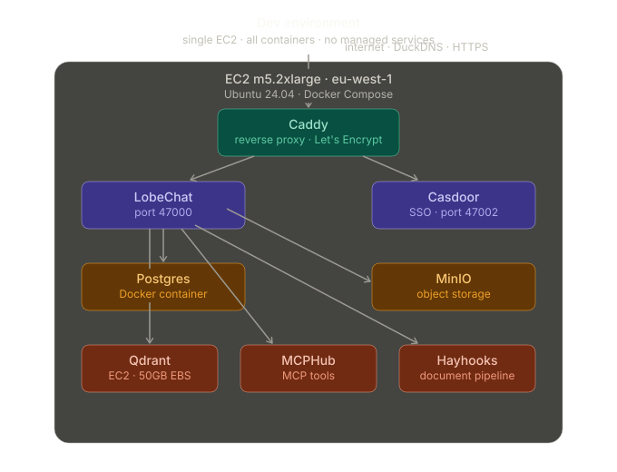

# Q2 — 3-environment architecture evolution

## Per-environment component table

| Component | Dev | Stage | Prod |
|---|---|---|---|
| EC2 instance | m5.2xlarge, all containers. Note: c7a.large was used in the practical deployment but proved memory-constrained under the full stack. m5.2xlarge recommended for all envs to ensure Qdrant has sufficient memory for vector operations alongside other containers | m5.2xlarge, app containers only (Postgres and MinIO offloaded to managed services) | m5.2xlarge, app containers only (Postgres and MinIO offloaded to managed services) |
| LobeChat | Docker container on EC2 | Docker container on EC2 | Docker container on EC2 |
| Casdoor | Docker container on EC2 | Docker container on EC2 | Docker container on EC2 |
| Postgres / RDS | Docker container on same EC2 | RDS db.t3.medium Single-AZ. Tests managed DB integration before prod | RDS db.t3.medium Multi-AZ. Automatic failover if primary AZ fails, recovery in 1-2 minutes without manual intervention |
| MinIO / S3 | Docker container on EC2 | AWS S3 Standard. Replaces MinIO container, tests real S3 behaviour before prod | AWS S3 Standard, versioning enabled, 24 month retention matching MiFID II obligation |
| Qdrant | Docker container on EC2, 50GB EBS gp3 | Docker container on EC2, 100GB EBS gp3, daily EBS snapshot | Docker container on EC2, 200GB EBS gp3, daily EBS snapshot via AWS DLM, weekly AMI backup |
| MCPHub | Docker container on EC2 | Docker container on EC2 | Docker container on EC2 |
| Hayhooks | Docker container on EC2 | Docker container on EC2 | Docker container on EC2 |
| Reverse proxy | Caddy on EC2, Let's Encrypt auto cert, DuckDNS | Caddy on EC2, Let's Encrypt auto cert, DuckDNS. No ALB needed since no real users | ALB + ACM. TLS terminated at load balancer. Caddy removed. ACM provisions and auto-renews certificate, free when used with ALB |
| DNS | DuckDNS or local hosts file | DuckDNS | Route53 hosted zone |
| Secrets | .env file, never committed to Git | AWS Secrets Manager | AWS Secrets Manager, rotation enabled |
| Monitoring | None, docker logs only | Basic CloudWatch agent | Full CloudWatch: logs, metrics, alarms |
| LLM backend | Anthropic API via OpenRouter | Anthropic API via OpenRouter | Anthropic API via OpenRouter |

---

## Qdrant on EC2 — sizing, snapshots, recovery

Qdrant stays on EC2 in all three environments because you need RAG always to be able to do queries in all envs. In dev, analysts need RAG working locally for testing. You cannot develop or test the document pipeline without Qdrant running. This also satisfies the hard constraint from the assignment. Qdrant EBS sizing grows across environments because the document corpus grows from a small test set in dev to a realistic sanitised corpus in stage to years of real regulatory filings and internal research notes in prod.

| Environment | EBS size | Snapshot policy | Recovery |
|---|---|---|---|
| Dev | 50GB gp3 | None | Restart container, re-seed from seed script |
| Stage | 100GB gp3 | Daily EBS snapshot | Restore from snapshot, re-attach volume |
| Prod | 200GB gp3 | Daily EBS snapshot via AWS DLM + weekly AMI backup | Restore from snapshot without re-embedding entire corpus. Weekly AMI provides additional recovery layer if EBS volume itself corrupts |

---

## AWS managed services in prod

Prod uses six AWS managed services, exceeding the required minimum of four. RDS PostgreSQL Multi-AZ replaces the Postgres Docker container and provides automatic failover without manual intervention. S3 replaces MinIO and provides eleven-nines durability with versioning for MiFID II-compliant file retention. ALB handles HTTPS termination and replaces Caddy, providing health checks and traffic distribution. ACM provisions and auto-renews the TLS certificate at no cost when used with ALB. Secrets Manager stores all environment secrets with rotation enabled, replacing the .env file approach used in dev. CloudWatch provides centralised logging, metrics, and alarms for the production platform. Route53 manages the DNS hosted zone with reliable resolution under regulatory scrutiny.

---

## Promotion flow

Dev writes code and pushes to a feature branch, then merges into main and deploys to dev via GitHub Actions automatically. To get to stage a PR is opened from main into the staging branch. To get to prod a PR is opened from staging into the production branch with a manual approval gate. Technical approval is always required. Compliance approval is required when the change touches identity, logging, or data handling for our MiFID II regulated firm. Tagging with cz bump marks the release point before prod deployment. Code and config move through Git PRs. Secrets never move through Git, managed independently per environment in Secrets Manager.

| Step | Action | Environment |
|---|---|---|
| 1 | Developer pushes to feature branch | Local |
| 2 | PR merged into main, GitHub Actions deploys automatically | Dev |
| 3 | PR opened from main into staging branch, GitHub Actions deploys | Stage |
| 4 | Technical approval: senior developer reviews PR | Gate |
| 5 | Compliance approval: required for changes touching identity, logging, or data handling | Gate |
| 6 | cz bump generates semantic version tag | Release point |
| 7 | PR merged into production branch, GitHub Actions deploys | Prod |

---

## Data strategy

In dev, real client data cannot be used so anonymised or synthetic data is needed. Fake client names, fake portfolio positions, real document structure but fictitious content. Qdrant in dev gets seeded with a small set of test documents, not the real research corpus. Stage gets a sanitised copy of prod data with PII stripped, so real document structure and real embedding distribution but no real client identities. This is important for RAG testing because you want to validate that Qdrant retrieval works against a realistic corpus, not just test documents. If RAG works in stage it will work in prod. Prod is backed up with RDS automated daily snapshots with 24 month retention for MiFID II, Qdrant EBS daily snapshots via AWS DLM, and a weekly AMI backup as an additional recovery layer in case the EBS volume itself corrupts rather than just the data. S3 versioning is enabled. RTO 4 hours, RPO 24 hours.

---

## Trade-off table

| Environment | Reliability | Cost | Ops complexity |
|---|---|---|---|
| Dev | Low. Single EC2, if it goes down everything goes down simultaneously | Low. One EC2, no managed services | Low. Docker Compose only, no managed service configuration |
| Stage | Medium. RDS gives database resilience but app layer still on single EC2. If EC2 fails the application goes down even though data survives in RDS | Medium. RDS and S3 add cost but no ALB | Medium. Managed services need configuration, more moving parts than dev |
| Prod | High. RDS Multi-AZ gives automatic failover, S3 is fully managed, ALB distributes traffic, Qdrant EBS snapshots enable vector index recovery. Qdrant requires manual snapshot monitoring since there is no managed vector DB fallback, adding operational overhead that RDS does not have | High. Full managed services stack plus ALB and CloudWatch | High. CloudWatch alarms, Secrets Manager rotation, ALB config, snapshot policies, plus manual Qdrant operational burden with no managed fallback |

---

## Reverse-proxy / TLS choice

In dev and stage Caddy handles reverse proxy and TLS. Caddy was chosen because it automatically provisions and renews Let's Encrypt certificates with zero configuration, integrates cleanly with DuckDNS for dynamic DNS, and has no cost. Since dev and stage have no real users there is no need for the scalability or health check features of a managed load balancer. In prod Caddy is replaced by ALB + ACM. ALB provides health checks, traffic distribution, and integrates natively with other AWS managed services. ACM provisions and auto-renews the TLS certificate for free when used with ALB. The switch from Caddy to ALB in prod eliminates a self-managed component from the critical path and removes the ops burden of certificate management from the EC2 instance.

---

## Architecture diagrams

